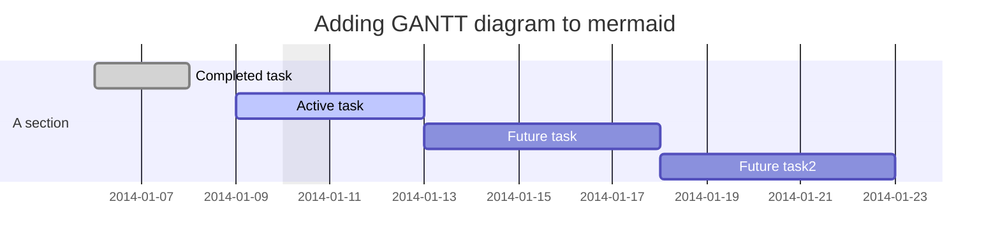
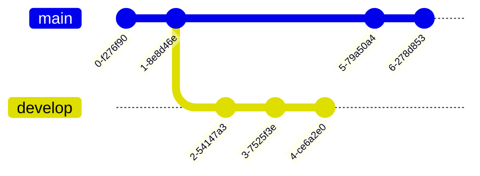
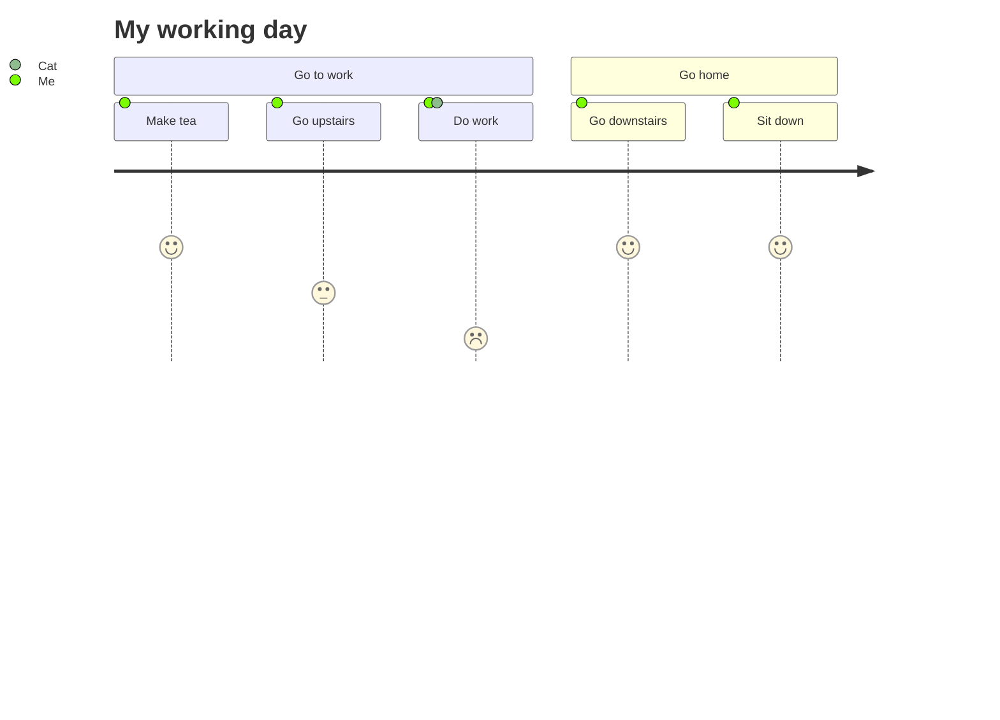

# About
A cheat sheet to make Markdown and writing on GitHub easier.

***
<details open><summary><h1>Headers</h1></summary>
A way to have the section folded and unfolded, then just normal headers.

    <details id=0 open> <summary><h1>Header</h1></summary>
    Spam.
    </details>

<details id=0 open> <summary><h1>Header</h1></summary>
Spam.
</details>

    # Header 1
    ## Header 2
    ### Header 3
    #### Header 4
    ##### Header 5
    ###### Header 6

# Header 1
## Header 2
### Header 3
#### Header 4
##### Header 5
###### Header 6
</details>

***
<details open><summary><h1>Text Formatting</h1></summary>
Change the way text looks and how it displays.

    *Italize* **Bold** ***Both***
    
    _Italize_ __Bold__ ___Both___
    
    ~~Strike Through~~ <sub>Subscript</sub> <sup>This is a superscript text</sup>

*Italize* **Bold** ***Both***

_Italize_ __Bold__ ___Both___

~~Strike Through~~ <sub>Subscript</sub> <sup>This is a superscript text</sup>
</details>

***
<details open><summary><h2>Links</h2></summary>
Linking to a URL or image.

    [Link](https://www.github.com)
    
    <p>This is an <a href=“http://example.com/“>example link</a>.</p>
    
    This is an [example link](http://example.com/ “With a Title”).
    
    
    
    [Reference Link][1] is the same link as [Reference Link][2]

    [1]: https://example.com
    [2]: https://example.com

[Link](https://www.github.com)

<p>This is an <a href=“https://example.com/“>example link</a>.</p>

This is an [example link](https://example.com/ “With a Title”).


[Reference Link][1] is the same link as [Reference Link][2]

[1]: https://example.com
[2]: https://example.com
</details>


***
<details open><summary><h1>Organization</h1></summary>
Get the info all in order.

## Lists
Different types and layouts of lists.

### Ordered List
Numbers the list, what comes after 1 doesn’t matter.

    1.
    *
    -
    +
 
1) 1
 * 2
  - 3
+ 4

***
### Unordered List
Just have dots making up the list.

    *
    - -
    +
    * [x]
    - [ ]
    + [ ] 
    
* 1
- - Outer
* [x] Checked
 * [ ] Unchecked
  * [ ] Unchecked

***
### Ordered & Unordered List
A combined type of list that has numbers and dots.

<ol>
<li>Candy.</li>
<ul>
<li>Gum.</li>
<li>Booze.</li>
</ul></ol>

<ol>
<li>A
<ol>
<li>B
</ol>
</li>
</ol>
</li>

***
## Tables

First Header  | Second Header | Third Header |
 ———— | :————: | ————: |
Cell	  |   *Cell*	  |	  Cell	|
Cell  |   **Cell**	|	  Cell	|

***
    | Rank | THING-TO-RANK |
    |-----:|---------------|
    |     1|Python|
    |     2|Web Development|
    |     3|               |

***
| First Header  | Second Header |
| -———— | -———— |
| Content Cell  | Content Cell  |
| Content Cell  | Content Cell  |

***
| Command | Description |
| — | — |
| git status | List all new or modified files |
| git diff | Show file differences that haven’t been staged |

***
| Left-aligned | Center-aligned | Right-aligned |
| :—         |     :—:      |          —: |
| git status   | git status     | git status    |
| git diff     | git diff       | git diff      |

***
| Name     | Character |
| —      | —       |
| Backtick | `         |
| Pipe     | \|        |

***
## Spacers

    ***
*** 

    - - - -
- - - -
</details>

***
<details open><summary><h1>Code Blocks</h1></summary>
A way to present code so that it’s a lot more visible.

* An indentation is 4 spaces, it makes a code block.

	Code
	block.

* Use >For code blocks. Only lines with text need >before the code.

>Other code block.

>Skipped line.

* ‘ Does not work. It must be a `, a word(s) with a backtick on each side would identify 1 word or multiple.

`<code>` spans are delimited
by backticks.
  
* ``` before and and after the text would identify the whole thing.

```
You can include literal backticks
like this.
```

<blockquote>
<p>Yes</p>
    <p>Test.</p>
</blockquote> 
</details>

***
<details open><summary><h1>References</h1></summary>

Reference this. [^1]

Testing [^2]

[^1]: Always goes to bottom.

[^2]: Second.

</details>

***
details open><summary><h1>Extra</h1></summary>

Experiment with lists.

- A
- - B
- * + C
 - D
 - 1. E
  * F

~~~
Code Fence
~~~

```
<
 >.   Yeah 
  -
```
Test

<table><tr><td>
<pre>
**Hello**,

_world_.
</pre>
</td></tr></table>

|test|
|:———|

* List
    * Is
* *    Here
  * b

A quote goes like this.

---
> Quote
- Test

    <!—Comment—> 

<!— Comment goes in here. —>

    <picture>
  <source media=“(prefers-color-scheme: dark)” srcset=“https://user-images.githubusercontent.com/25423296/163456776-7f95b81a-f1ed-45f7-b7ab-8fa810d529fa.png”>
  <source media=“(prefers-color-scheme: light)” srcset=“https://user-images.githubusercontent.com/25423296/163456779-a8556205-d0a5-45e2-ac17-42d089e3c3f8.png”>
  
</picture>

```[tasklist]

\ escape character

Syntax highlighting in code block.
```ruby
require ‘redcarpet’
markdown = Redcarpet.new(“Hello World!”)
puts markdown.to_html
```

Flowchart
```mermaid
graph TD;
    A—>B;
    A—>C;
    B—>D;
    C—>D;
```

Sequence Diagram
```mermaid
sequenceDiagram
    participant Alice
    participant Bob
    Alice->>John: Hello John, how are you?
    loop Healthcheck
        John->>John: Fight against hypochondria
    end
    Note right of John: Rational thoughts <br/>prevail!
    John—>>Alice: Great!
    John->>Bob: How about you?
    Bob—>>John: Jolly good!
```

Gantt Diagram


Class Diagram
```mermaid
classDiagram
Class01 <|— AveryLongClass : Cool
Class03 *— Class04
Class05 o— Class06
Class07 .. Class08
Class09 —> C2 : Where am i?
Class09 —* C3
Class09 —|> Class07
Class07 : equals()
Class07 : Object[] elementData
Class01 : size()
Class01 : int chimp
Class01 : int gorilla
Class08 <—> C2: Cool label
```

Git Graph


Entity Relationship Diagram
```mermaid
erDiagram
    CUSTOMER ||—o{ ORDER : places
    ORDER ||—|{ LINE-ITEM : contains
    CUSTOMER }|..|{ DELIVERY-ADDRESS : uses
```

User Journey Diagram


```geojson
{
  “type”: “FeatureCollection”,
  “features”: [
    {
      “type”: “Feature”,
      “id”: 1,
      “properties”: {
        “ID”: 0
      },
      “geometry”: {
        “type”: “Polygon”,
        “coordinates”: [
          [
              [-90,35],
              [-90,30],
              [-85,30],
              [-85,35],
              [-90,35]
          ]
        ]
      }
    }
  ]
}
```

```topojson
{
  “type”: “Topology”,
  “transform”: {
    “scale”: [0.0005000500050005, 0.00010001000100010001],
    “translate”: [100, 0]
  },
  “objects”: {
    “example”: {
      “type”: “GeometryCollection”,
      “geometries”: [
        {
          “type”: “Point”,
          “properties”: {“prop0”: “value0”},
          “coordinates”: [4000, 5000]
        },
        {
          “type”: “LineString”,
          “properties”: {“prop0”: “value0”, “prop1”: 0},
          “arcs”: [0]
        },
        {
          “type”: “Polygon”,
          “properties”: {“prop0”: “value0”,
            “prop1”: {“this”: “that”}
          },
          “arcs”: [[1]]
        }
      ]
    }
  },
  “arcs”: [[[4000, 0], [1999, 9999], [2000, -9999], [2000, 9999]],[[0, 0], [0, 9999], [2000, 0], [0, -9999], [-2000, 0]]]
}
```

```stl
solid cube_corner
  facet normal 0.0 -1.0 0.0
    outer loop
      vertex 0.0 0.0 0.0
      vertex 1.0 0.0 0.0
      vertex 0.0 0.0 1.0
    endloop
  endfacet
  facet normal 0.0 0.0 -1.0
    outer loop
      vertex 0.0 0.0 0.0
      vertex 0.0 1.0 0.0
      vertex 1.0 0.0 0.0
    endloop
  endfacet
  facet normal -1.0 0.0 0.0
    outer loop
      vertex 0.0 0.0 0.0
      vertex 0.0 0.0 1.0
      vertex 0.0 1.0 0.0
    endloop
  endfacet
  facet normal 0.577 0.577 0.577
    outer loop
      vertex 1.0 0.0 0.0
      vertex 0.0 1.0 0.0
      vertex 0.0 0.0 1.0
    endloop
  endfacet
endsolid
```

Embedding
    <script src=“https://embed.github.com/view/geojson/<username>/<repo>/<ref>/<path_to_file>”></script>

CSV

mmd file is mermaid

# Linking to Markdown
ou can link to specific lines in Markdown files by loading the Markdown file without Markdown rendering. To load a Markdown file without rendering, you can use the ?plain=1 parameter at the end of the url for the file. For example, github.com/<organization>/<repository>/blob/<branch_name>/README.md?plain=1.

You can link to a specific line in the Markdown file the same way you can in code. Append #L with the line number or numbers at the end of the url. For example, github.com/<organization>/<repository>/blob/<branch_name>/README.md?plain=1#L14 will highlight line 14 in the plain README.md file.